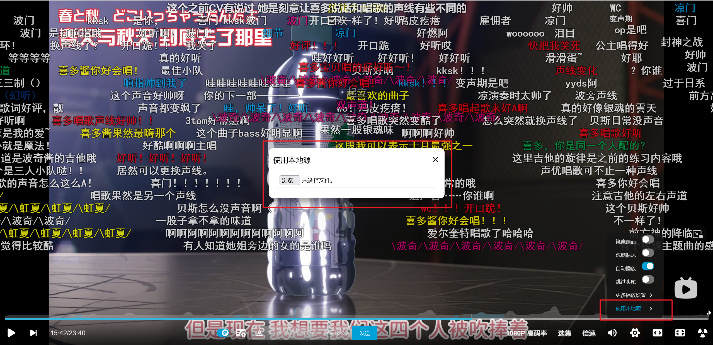

# Bilibili Redirect

重定向 [Bilibili](https://www.bilibili.com) 的视频播放到本地文件。

### 用法

1. 运行服务端
    * 直接运行 `bilibili-redirect` 二进制文件
    
        将 `bilibili-redirect(.exe)` 复制至媒体存储目录直接运行。
        
    * 使用命令行运行  
    
        ```text
        Usage of bilibili-redirect.exe:
           -l string
               Local server listen address (default "localhost:10808")
           -p string
               Local server root path (default ".")
        ```

2. 安装 userscript (需要 Tampermonkey 等浏览器插件)  

    访问程序输出的脚本地址
    ```text
    Serve '/path/to/media/store' at http://localhost:10808
    Script at http://localhost:10808/bilibili-redirect.user.js  <== this link
    ```

3. 使用播放器内的 `使用本地源` 按钮  

    

### 构建

1. 安装依赖 `go`
2. 执行命令 `go build`
